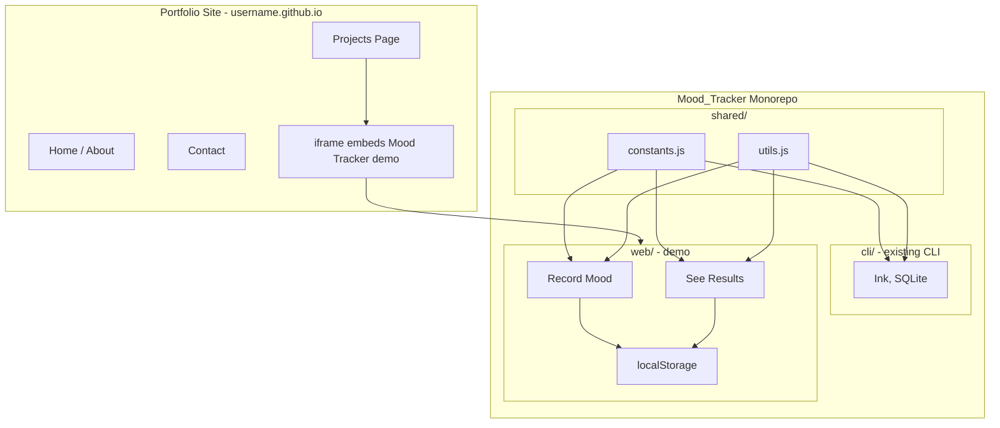

# Personal Portfolio Website Plan

## Architecture Overview




**Repos:**

1. **Portfolio site** (`yourusername.github.io`) – Vite + React at `username.github.io`
2. **Mood Tracker** (existing `Mood_Tracker` repo) – Monorepo: `cli/` (CLI), `web/` (demo), `shared/`. Web demo deploys to `username.github.io/mood-tracker-demo`

---

## Part 1: Portfolio Site

**Repo:** `yourusername.github.io` (must match your GitHub username)

**Tech:** Vite + React

**Structure:**

- **Home** – Intro, tech stack, brief bio
- **Projects** – Card layout for each project; Mood Tracker card includes iframe pointing to the demo URL
- **Contact** – Email, LinkedIn, GitHub links

**Key files:**

- `vite.config.js` – `base: '/'` (user site = root)
- `src/App.jsx` – Router (React Router) or simple section navigation
- `src/pages/Projects.jsx` – Project cards + iframe for Mood Tracker

**Deployment:** Add `.github/workflows/deploy.yml` (see GitHub Actions Workflow section). Set Pages source to GitHub Actions. Push to `main` triggers build and deploy.

---

## Part 2: Mood Tracker Monorepo (CLI + Web Demo)

**Repo:** Existing `Mood_Tracker` repo, restructured as monorepo

**Structure:**

```
Mood_Tracker/
├── cli/                    # Existing CLI (move current code here)
│   ├── index.js
│   ├── App.jsx
│   ├── database.js
│   ├── components/
│   ├── screens/
│   └── package.json
├── web/                    # Web demo (new)
│   ├── src/
│   │   ├── App.jsx
│   │   ├── components/
│   │   ├── hooks/
│   │   └── main.jsx
│   ├── vite.config.js
│   └── package.json
├── shared/                 # Shared code (CLI and web both use)
│   ├── constants.js        # SCREENS, mood values
│   └── utils.js            # formatTimestamp, getMoodEmoji
└── package.json            # Workspace root (optional npm workspaces)
```

**Shared code:** Mood emojis, mood values, timestamp formatting, screen constants. Changes to shared code propagate to both CLI and web.

**Web demo tech:** Vite + React, localStorage instead of SQLite. Imports from `../shared/`.

**Data model (mirrors CLI):**


| Field      | Type   | Storage      |
| ---------- | ------ | ------------ |
| id         | number | generated    |
| mood_value | 1–5    | localStorage |
| timestamp  | ISO    | localStorage |
| notes      | string | localStorage |


**Core flows (adapted from CLI):**

1. **Menu** – "Record Mood" and "See Results" (simplified; no logo colour)
2. **Record Mood** – Select mood 1–5 (emojis from shared), optional note (Yes/No + text input), save to localStorage
3. **See Results** – Paginated table (ID, Mood, Date, Time, Notes) with Next/Prev; optional "By Day" view later

**UI adaptations:** Replace Ink with React DOM: `div`, `button`, CSS. Use emoji or face icons for moods (from shared utils).

**Key files (web/):**

- `vite.config.js` – `base: '/mood-tracker-demo/'`
- `src/hooks/useMoodStorage.js` – localStorage read/write
- `src/components/MoodSelection.jsx` – Mood picker (buttons)
- `src/components/ResultsScreen.jsx` – Table with pagination

**Deployment:** Workflow builds `web/` and deploys `web/dist/` to GitHub Pages at `username.github.io/mood-tracker-demo`. See GitHub Actions Workflow section for monorepo workflow.

---

## Part 3: Integration

**Portfolio iframe:** (replace `<repo-name>` with your Mood Tracker repo name, e.g. `Mood_Tracker` or `mood-tracker-demo`)

```html
<iframe 
  src="https://yourusername.github.io/<repo-name>" 
  width="100%" 
  height="500" 
  title="Mood Tracker Demo"
></iframe>
```

**Order of work:**

1. Restructure Mood_Tracker as monorepo (move CLI to `cli/`, add `shared/`)
2. Build web demo in `web/`
3. Add workflow to deploy web demo, verify at `username.github.io/mood-tracker-demo`
4. Build portfolio site, add iframe

---

## Repository Setup


| Project      | Repo name                 | URL                                                                 |
| ------------ | ------------------------- | ------------------------------------------------------------------- |
| Portfolio    | `yourusername.github.io`  | `https://yourusername.github.io`                                    |
| Mood Tracker | `Mood_Tracker` (existing) | CLI: local; Web: `https://yourusername.github.io/mood-tracker-demo` |


---

## What Gets Simplified (Demo vs CLI)

- **Removed:** Logo colour picker, keyboard navigation, terminal resize handling
- **Replaced:** Ink components → HTML/CSS, better-sqlite3 → localStorage
- **Same:** Mood values 1–5, notes, record flow, results table with pagination
- **Optional later:** Graph view, "By Day" grouping

---

## Suggested File Locations

**Portfolio** – separate repo:

```
~/Dev/
└── yourusername.github.io/     # Portfolio repo
    ├── src/
    │   ├── App.jsx
    │   ├── pages/
    │   │   ├── Home.jsx
    │   │   ├── Projects.jsx
    │   │   └── Contact.jsx
    │   └── main.jsx
    ├── .github/workflows/deploy.yml
    ├── vite.config.js
    └── package.json
```

**Mood Tracker** – monorepo (existing repo, restructured):

```
~/Dev/Github/
└── Mood_Tracker/               # Existing repo
    ├── cli/                    # Existing CLI (move current files here)
    │   ├── index.js
    │   ├── App.jsx
    │   ├── database.js
    │   ├── components/
    │   ├── screens/
    │   ├── setupTerminal.js
    │   └── package.json
    ├── web/                    # New web demo
    │   ├── src/
    │   │   ├── App.jsx
    │   │   ├── components/
    │   │   ├── hooks/
    │   │   └── main.jsx
    │   ├── vite.config.js
    │   └── package.json
    ├── .github/workflows/deploy.yml
    ├── shared/
    │   ├── constants.js
    │   └── utils.js
    └── package.json
```

---

## GitHub Actions Workflow

### What It Solves

GitHub Pages serves static files (HTML, CSS, JS) only. It does not run `npm` or Vite. Your React app needs a build step to produce those static files. The workflow runs that build on GitHub's servers and deploys the output automatically.

**Without workflow:** You run `npm run build` locally, commit `dist/`, push. Clutters git, easy to forget.

**With workflow:** You push source code only. GitHub runs the build and deploys. No build artifacts in repo, consistent environment, automatic on every push.

### What It Does

1. **Trigger** – Runs when you push to `main` (or manually via Actions tab)
2. **Checkout** – Clones your repo on a fresh VM
3. **Install** – `npm ci` (clean install from lockfile)
4. **Build** – `npm run build` → Vite outputs `dist/`
5. **Deploy** – Uploads `dist/` to GitHub Pages

### Setup

**Each repo needs:** `.github/workflows/deploy.yml` + **Settings → Pages** → Source = **GitHub Actions**

---

**Portfolio workflow** (`yourusername.github.io/.github/workflows/deploy.yml`): Standard build from repo root. Build outputs to `dist/`.

**Mood Tracker workflow** (`Mood_Tracker/.github/workflows/deploy.yml`): Monorepo – build from `web/` subdirectory. Build outputs to `web/dist/`.

```yaml
# Mood_Tracker monorepo – deploys web demo only
name: Deploy Mood Tracker Web Demo

on:
  push:
    branches: ['main']
  workflow_dispatch:

permissions:
  contents: read
  pages: write
  id-token: write

concurrency:
  group: 'pages'
  cancel-in-progress: true

jobs:
  deploy:
    environment:
      name: github-pages
      url: ${{ steps.deployment.outputs.page_url }}
    runs-on: ubuntu-latest
    steps:
      - name: Checkout
        uses: actions/checkout@v5

      - name: Set up Node
        uses: actions/setup-node@v6
        with:
          node-version: lts/*
          cache: 'npm'

      - name: Install dependencies
        working-directory: ./web
        run: npm ci

      - name: Build
        working-directory: ./web
        run: npm run build

      - name: Setup Pages
        uses: actions/configure-pages@v5

      - name: Upload artifact
        uses: actions/upload-pages-artifact@v4
        with:
          path: './web/dist'

      - name: Deploy to GitHub Pages
        id: deployment
        uses: actions/deploy-pages@v4
```

---

**Portfolio workflow** (standard, repo root):

```yaml
name: Deploy static content to Pages

on:
  push:
    branches: ['main']
  workflow_dispatch:

permissions:
  contents: read
  pages: write
  id-token: write

concurrency:
  group: 'pages'
  cancel-in-progress: true

jobs:
  deploy:
    environment:
      name: github-pages
      url: ${{ steps.deployment.outputs.page_url }}
    runs-on: ubuntu-latest
    steps:
      - name: Checkout
        uses: actions/checkout@v5
      - name: Set up Node
        uses: actions/setup-node@v6
        with:
          node-version: lts/*
          cache: 'npm'
      - name: Install dependencies
        run: npm ci
      - name: Build
        run: npm run build
      - name: Setup Pages
        uses: actions/configure-pages@v5
      - name: Upload artifact
        uses: actions/upload-pages-artifact@v4
        with:
          path: './dist'
      - name: Deploy to GitHub Pages
        id: deployment
        uses: actions/deploy-pages@v4
```

---

**Vite base config:**

- Portfolio: `base: '/'`
- Mood Tracker web: `base: '/<repo-name>/'` – must match the repo name (e.g. `Mood_Tracker` → `base: '/Mood_Tracker/'`, URL: `username.github.io/Mood_Tracker`). If you rename the repo to `mood-tracker-demo`, use `base: '/mood-tracker-demo/'`.