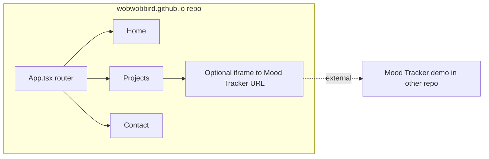

# Portfolio Site Plan – [wobwobbird.github.io](http://wobwobbird.github.io)

This plan adapts the original [personal_portfolio_website_55ad007b.plan.md](plan/personal_portfolio_website_55ad007b.plan.md) to the **current** repository: **wobwobbird.github.io**. That plan assumed a different repo layout; here we only build the portfolio in this repo. The Mood Tracker (if you have it) lives in another repo; this plan adds optional iframe integration once that demo is deployed.

---

## Current state (this repo)

- **Stack:** Vite 7 + React 19 + TypeScript (not JSX).
- **Structure:** Default Vite starter with [src/App.tsx](src/App.tsx) (counter), [src/main.tsx](src/main.tsx), [vite.config.ts](vite.config.ts) (no `base` set), no router, no pages.
- **Deploy:** No `.github/workflows`; GitHub Pages not configured for build-from-source.

---

## Target architecture

---

## Part 1: Portfolio content and routing

**Goal:** Replace the default Vite counter UI with a simple portfolio: Home, Projects, Contact.

- **Routing:** Add `react-router-dom`. In [src/App.tsx](src/App.tsx), use `BrowserRouter`, `Routes`, `Route`, and a small nav (links to `/`, `/projects`, `/contact`). Use `basename` only if you need a subpath (for user site at root, omit or use `basename="/"`).
- **Pages (new):**
  - `src/pages/Home.tsx` – Intro, tech stack, short bio.
  - `src/pages/Projects.tsx` – Card layout for projects; one card can include an iframe pointing to your Mood Tracker demo URL (e.g. `https://wobwobbird.github.io/mood-tracker-demo`) once that exists in the other repo.
  - `src/pages/Contact.tsx` – Email, LinkedIn, GitHub, etc.
- **Assets:** Replace or remove Vite/React logo usage from [src/App.tsx](src/App.tsx) and wire the app title in [index.html](index.html) to something like “Your Name – Portfolio”.

**Key files to add/change:**

- [src/App.tsx](src/App.tsx) – Router and nav.
- [src/pages/Home.tsx](src/pages/Home.tsx), [src/pages/Projects.tsx](src/pages/Projects.tsx), [src/pages/Contact.tsx](src/pages/Contact.tsx) – New page components.
- [index.html](index.html) – Page title.

---

## Part 2: GitHub Pages and Vite config

**Goal:** Build and deploy from this repo to `https://wobwobbird.github.io` (user site = root).

- **Vite:** In [vite.config.ts](vite.config.ts), set `base: '/'` so asset paths work at the root of the site.
- **Router:** For user site at root, use `BrowserRouter` with no `basename` (or `basename="/"`). Avoid `HashRouter` if you want clean URLs.

**Deploy workflow:** Add [.github/workflows/deploy.yml](.github/workflows/deploy.yml) so that every push to `main` builds and deploys:

1. Checkout repo.
2. Set up Node (e.g. `actions/setup-node@v4` with `node-version: 'lts/*'`, `cache: 'npm'`).
3. `npm ci` then `npm run build` (build output: `dist/`).
4. Use `actions/configure-pages@v4`, `actions/upload-pages-artifact@v3` with `path: './dist'`, and `actions/deploy-pages@v4`.
5. Set `permissions: contents: read`, `pages: write`, `id-token: write` and optional `concurrency: group: 'pages'`.

**Repo settings:** In GitHub → Settings → Pages, set source to **GitHub Actions**.

---

## Part 3: Optional – Mood Tracker iframe

The Mood Tracker app and its web demo live in a **different** repository. This repo only embeds it.

- When the Mood Tracker web demo is deployed (e.g. at `https://wobwobbird.github.io/mood-tracker-demo` from the other repo), add an iframe in [src/pages/Projects.tsx](src/pages/Projects.tsx) in the Mood Tracker project card:
  - `src="https://wobwobbird.github.io/mood-tracker-demo"` (or the actual URL you use).
  - Sensible `width`/`height` and `title` for accessibility.

No Mood Tracker code or build in this repo; only the iframe and a short project description.

---

## Suggested order of work

1. Add `react-router-dom`, create `src/pages/` and Home/Projects/Contact, and wire routing and nav in `App.tsx`.
2. Set `base: '/'` in `vite.config.ts` and add `.github/workflows/deploy.yml`; enable Pages from Actions and verify deploy.
3. Replace placeholder content with your copy and styling; add the Mood Tracker project card and iframe when the demo URL is available.

---

## Differences from the original plan

- **Single repo in scope:** Only wobwobbird.github.io. No Mood Tracker monorepo or shared code here.
- **TypeScript:** Use `.tsx` and type-safe props where helpful (e.g. for project cards).
- **Mood Tracker:** Treated as an external deployment; this plan only adds the iframe and project card when you have the URL.

